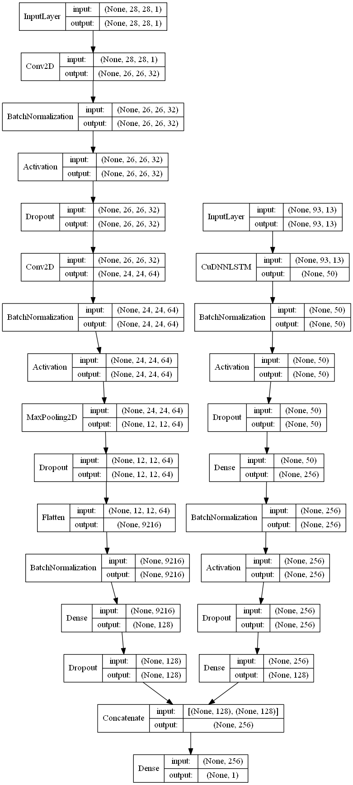
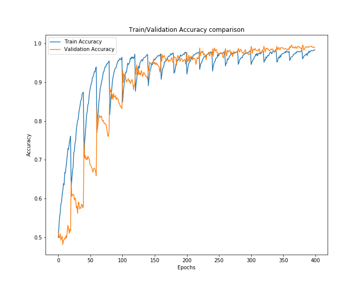
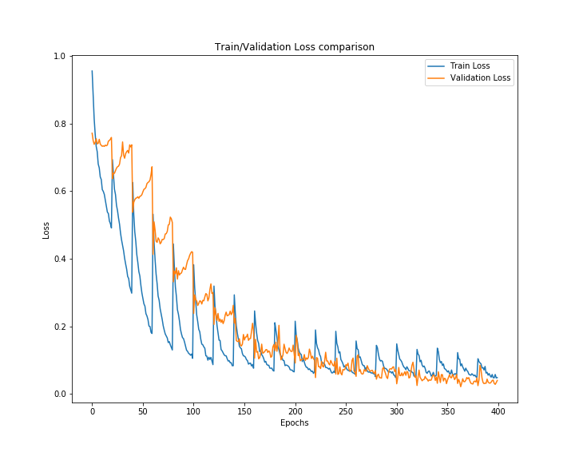
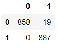

#### Note: 
    - First Read the Task.docx file to understand the required work.
    - Download the Dataset Files from below link and place them in Dataset Directory.
[Dataset Download Link](https://www.dropbox.com/sh/9kkqqaownbapyz5/AAD0MkT1ZZv-Kmf26obVhBLha?dl=0)

# Multi-Model-Approach-for-Speak-and-text-image-Association-Prediction
Our task is to Recognize whether an image of a hand-written digit and a recording of a spoken digit refer to the same or different number. We have two input data written number image and number spoken sound MFCC features and one output consist of boolean array state that the respective sound and image matches or not. We choose multi model approach using LSTM for audio features and CNN for image data. The output of both model concatenated at the end and binary loss function applied. 

### Data Preprocessing: 

Speak data consists of variable length, and is given as an array of shape (N, 13), where N is the number of frames in the recording, and 13 is the number of MFCC features. We applied padding operation to make it same length sequence, so that vectorization allows code to efficiently perform the matrix operations on the batch. The pad_sequences() function in the Keras deep learning library is used for this purpose. The function pad zero to match the any array of features to the biggest features array available in the system. After applying this the train spoken data shape become (45000, 93, 13) where 45000 is number of training examples. Furthermore, As match train consists of boolean array we have also applied Label Encode on it that Encode labels with value Between 0 and 1.

### Model Building and Parameters Tuning: 

We choose multi model approach with LSTM and CNN based models used for speak and image respectively. And concatenated the both model output then applies binary cross entropy loss and Adam optimizer. We have also used Batch Normalization at each deep layer to Normalize the activation at each layer and also avoid over fitting. We have used sigmoid activation function at last layer as we are dealing with binary problem. The structure of our model design shown in the figure 1. with each layer dimension.

As the data consists of 89 percent of class 0 family that’s why to solve class imbalance problem, we choose randomly equal size of both classes data picking at each epoch and trained model on it. The model training accuracy and loss curve shown in the figure 2.

### Performance Evaluation: 

Model is evaluated on test data consists of 877 class 0 dataset, and 887 class one dataset. The model have shown 98.92% prediction accuracy. The confusion matrix shows that the model has predicted 19 wrong example from class 0 and nothing wrong predicted from class 1. 

The Trained model and test data prediction has been saved in the folder to further check the working and evaluation of model performance.

